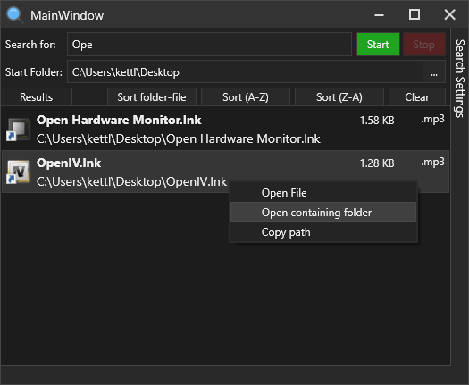

# FolderDeepSearchV2
A simple application for searching folders for items (files, folders or file contents), with recursive search options, string options, etc.

I made this as a replacement for windows explorer's dreadful search feature which takes forever just to find a file (as it's indexing while searching. Even after turning that off, it's still slow). This app does no indexing.

The search is done asynchronously, to stop the UI thread freezing. I made the start and stop buttons separate, just in case you try to cancel the search, but end up starting it again because it finished right as you clicked the button

## Preview
Planning on making the UI a bit less "clunky" (It just seems a bit clogged to me; i'm not great at UI design)

## Features
On the right of the screen is a toggle button, which opens a menu, which contains the search options (which are all checkboxes, allowing you to combine them all)
- Search folder names
- Search file names
- Search file contents

Searching file contents reads in chunks of 1024 bytes; does not load the entire file into memory. I wrote this to be as efficient as possible, using a fixed buffer size + size of the search term, and (n being the search term's string length) copies n number of chars from the end to the start, and when reading chars from files, begins at index n into the buffer. All of this in the case that the search term is split between 2 chunk reads

- Enable/disable case sensitivity (disable by default; meaning, cases are ignored; "hElLO" matches "Hello")
- Recursively search into folders (disabled by default; meaning, only the Start Folder is searched)
- Ignore file extension (completely forgot what this does)
- File/Folder match only if it starts with the search term (disabled by default; meaning a file called "Hi there.txt" may match a search term "there". But when enabled, it would not match. "A search term of "hi" may match, both cases depending on the case sensitivity option)

Also, when the app opens, the search bar is automatically focused so you don't need to click it. Clicking the Esc key will close the app (for convenience, if you only needed to do a quick search)

There are some shortcuts to toggling options, instead of having to use the menu on the right

- CTRL + B - Toggle case sensitivity (couldn't use CTRL + C, as it's used for copy)
- CTRL + R - Toggles recursive searching
- CTRL + N - Toggle match when folder/file name starts with search term instead of containing it
- CTRL + O - Shortcut for opening a folder
- Pressing enter while the search term box is focused will begin the search

## Adding to windows context menus

It's possible to add a few registry options to open the app in the folder you're currently in (in windows explorer).
- Go to `Computer\HKEY_CLASSES_ROOT\Directory\Background\shell`
- Create a new key/folder called `FolderDeepSearch` (or anything you'd like)
- Inside that, set the (Default)'s contents to the text you want in the windows context menu (e.g `Search folder...`)
- Optionally, create a new string called "Icon" and set the path to this app's .exe (you have to compile it obviously to get the exe file)
- Create a sub-key called `command`
- Set the (Default) contents to `"path to the app exe" "%V"` (make sure to include the quotes)
After doing that, it should appear in your context menu, and when you click it, it will set the app's start folder to which ever folder you opened the app in (This is processed in Application_Startup() in App.xaml.cs using StartupEventArgs)
